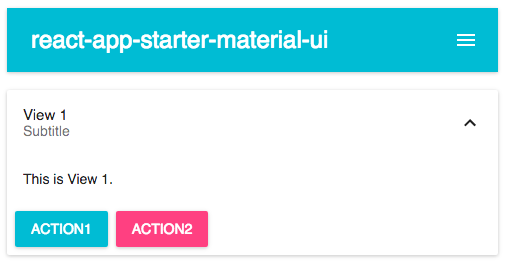

### react-app-starter-material-ui

A starter project for writing a react app with material-ui components.

Front-end stack:

- babel for latest JS language support
- react-router for UI layout and navigation
- material-ui for style and UI components
- webpack for js transpilation and commonjs modules
- webpack-dev-server for incremental builds on save and live reload

Usage:

```bash
$ npm install
$ npm start
```


